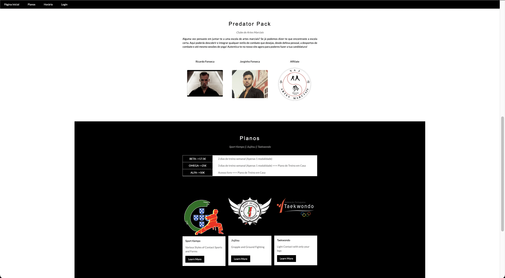
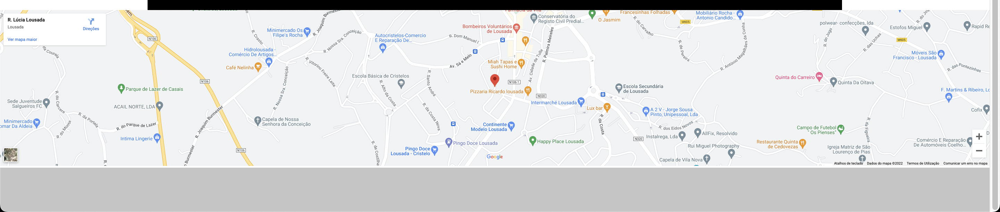
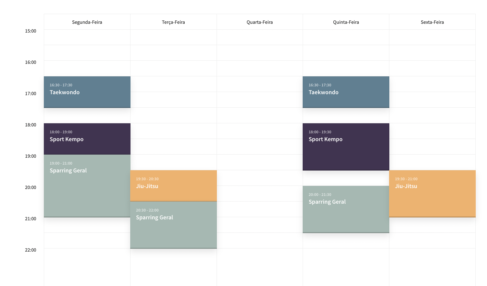
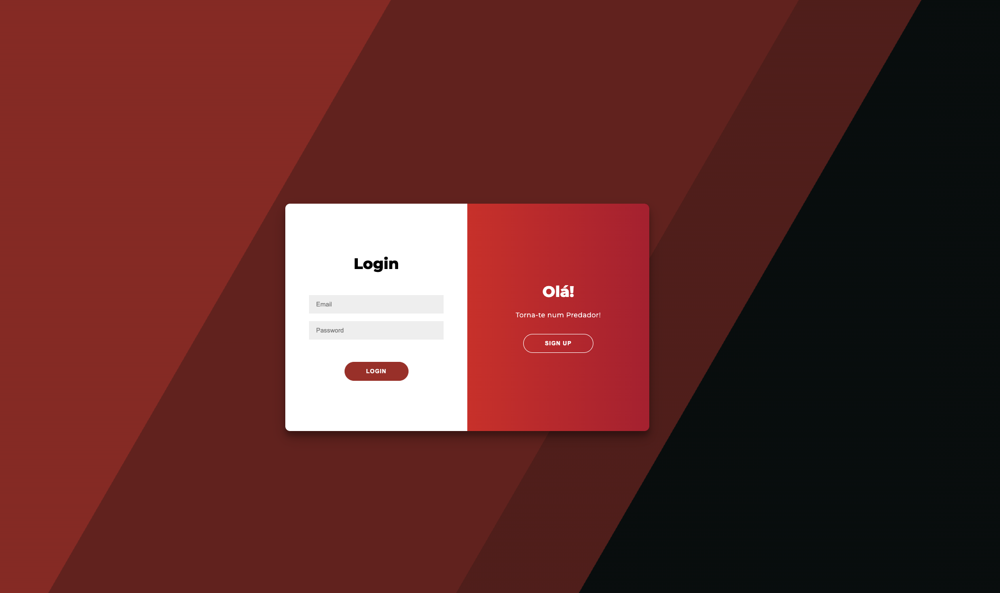

# PredatorPack

<!--
*** Thanks for checking out the Best-README-Template. If you have a suggestion
*** that would make this better, please fork the repo and create a pull request
*** or simply open an issue with the tag "enhancement".
*** Don't forget to give the project a star!
*** Thanks again! Now go create something AMAZING! :D
-->

<!-- PROJECT SHIELDS -->
<!--
*** I'm using markdown "reference style" links for readability.
*** Reference links are enclosed in brackets [ ] instead of parentheses ( ).
*** See the bottom of this document for the declaration of the reference variables
*** for contributors-url, forks-url, etc. This is an optional, concise syntax you may use.
*** https://www.markdownguide.org/basic-syntax/#reference-style-links
-->

<!-- PROJECT LOGO -->
 

  

<h3 align="center">PredatorPack</h3>

  

    This project is a website that allows a martial arts school to control all of their applicants and accept or refuse their application (confirmation sent via email with SMTP). In the main website you have useful information such as the martial arts the school has, as well as location, plans to train and more. 

    Any user that wants to apply to the school must create an account and be logged in so that they can submit their data to the admins.
    There is also a page that can show the products currently available at the school for in store purchasing, which can be controlled by the admins in the admin section. So basically i have developed a simple CRUD system for products.
     
    <a href="https://github.com/clickpy22/PredatorPack/issues">Report Bug</a>
    ·
    <a href="https://github.com/clickpy22/PredatorPack/issues">Request Feature</a>
  

<!-- TABLE OF CONTENTS -->

  
Table of Contents

  <ol>
    <li>
      <a href="#about-the-project">About The Project</a>
      <ul>
        <li><a href="#built-with">Built With</a></li>
      </ul>
    </li>
    <li><a href="#usage">Usage</a></li>
    <li><a href="#license">License</a></li>
    <li><a href="#contact">Contact</a></li>
  </ol>

<!-- ABOUT THE PROJECT -->
## About The Project

[![Product Name Screen Shot][product-screenshot]](https://example.com)

### Built With

* [JQuery](https://jquery.com)
* [JavaScript](https://developer.mozilla.org/pt-BR/docs/Web/JavaScript)
* [PHP](https://www.php.net/)
* [HTML](https://developer.mozilla.org/pt-BR/docs/Web/HTML)
* [CSS](https://developer.mozilla.org/pt-BR/docs/Web/CSS)

<!-- USAGE EXAMPLES -->
## MainPage

In this topic you can get used to the main page of the website in different images shown below:

<!-- LICENSE -->
## License

Distributed under the MIT License. See `LICENSE.txt` for more information.

<!-- CONTACT -->
## Contact

João Lázaro  - joaolazaro720@gmail.com

Project Link: https://github.com/clickpy22/PredatorPack

Linkedin Profile: www.linkedin.com/in/jlazaro22/

<!-- MARKDOWN LINKS & IMAGES -->
<!-- https://www.markdownguide.org/basic-syntax/#reference-style-links -->
[issues-shield]: https://img.shields.io/github/issues/clickpy22/PredatorPack.svg?style=for-the-badge
[issues-url]: https://github.com/clickpy22/PredatorPack/issues
[license-shield]: https://img.shields.io/github/license/clickpy22/PredatorPack.svg?style=for-the-badge
[license-url]: https://github.com/clickpy22/PredatorPack/blob/main/LICENSE.txt
[linkedin-shield]: https://img.shields.io/badge/-LinkedIn-black.svg?style=for-the-badge&logo=linkedin&colorB=555
[linkedin-url]: www.linkedin.com/in/jlazaro22/
[product-screenshot]: img/screenshot.png
